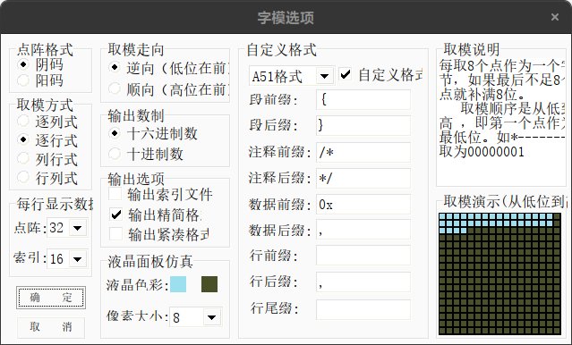

🍪🍪🍪🍪🍪🍪🍪🍪🍪🍪🍪画饼中

## 简介

使用 Esp8285 或者 ESP8266 控制 PMOS 通断加热，可用于 T12 电烙铁或者 PCB 拆焊台，使用双按键或者单编码器操作，使用 [GS8551](http://www.semiee.com/002547f3-8d6a-4e20-8d2c-8b5922c1cb3d.html) 读取热电偶温度。

使用 PlatformIO + CLion ，使用 Arduino 框架开发，环境配置参见[这里](https://www.jianguoyun.com/p/DcLwExQQjeHjChiP5twEIAA)，或者参见[官方文档](https://docs.platformio.org/en/latest/integration/ide/clion.html#ide-clion)

## 芯片 Datasheet

MCU：[ESP8266](https://www.espressif.com/zh-hans/support/documents/technical-documents?keys=&field_type_tid%5B%5D=492)  [ESP8285](http://www.semiee.com/search?searchModel=esp8285)  ESP8285H16（2M）  ESP8285N08 ESP8285H08（1MB）

放大器：[GS8551](http://www.semiee.com/002547f3-8d6a-4e20-8d2c-8b5922c1cb3d.html) 

电源：[JW5026](http://www.semiee.com/0be2323a-29ac-47c7-a57d-88a9e1451cfb.html)  [FS312](http://www.semiee.com/5d0a8fc3-8f2a-4743-9e56-e9378ba42125.html)

## 说明

### 图片、文字取模

使用 [PCtoLCD2002](https://github.com/fishjump/PCtoLCD2002_exe)，修改设置如图：

### 设置解释
